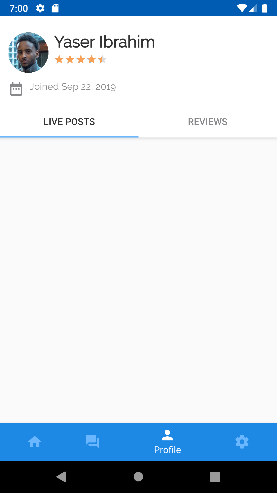

## Built

So far, a user on the app can do the following:

1. Make a post requesting a service from those nearby

2. Check the feed for services being requested

3. Start a chat with users asking for a service

4. Share their location by sending a map with a pin on current location

  

  

  

  

  

  

  

  

## In Progress

Currently working on the profile page to display users live posts.

  

## TO DO

1. Assign service to user
2. Close/Cancel service when done
3. Rate user after service is closed
4. Show ratings on profile view and add sign out option(i.e remove settings page from bottomnav)
5. Sign in with Google/Uni email
6. Show that account is verified if logged in with uni email

## Bugs

1. "Scroll up to see new favours" fav is glitchy
2. If location permissions weren't granted feed isn't displayed immediately after they are. App must first restart.
