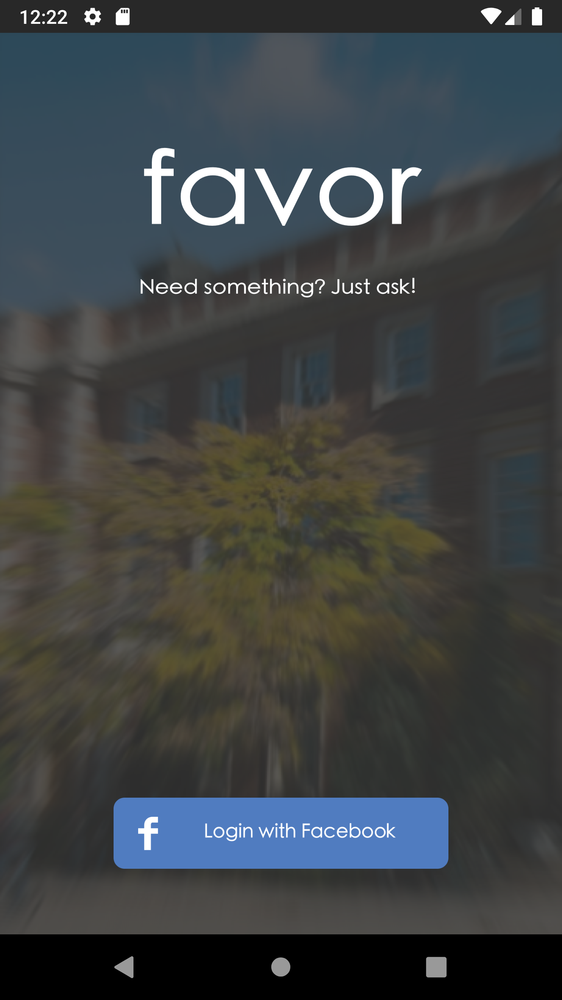
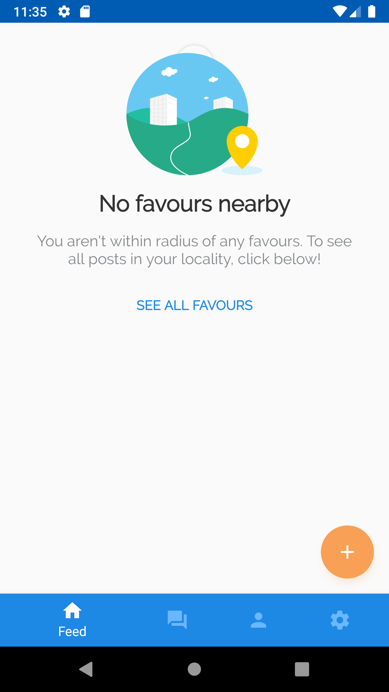
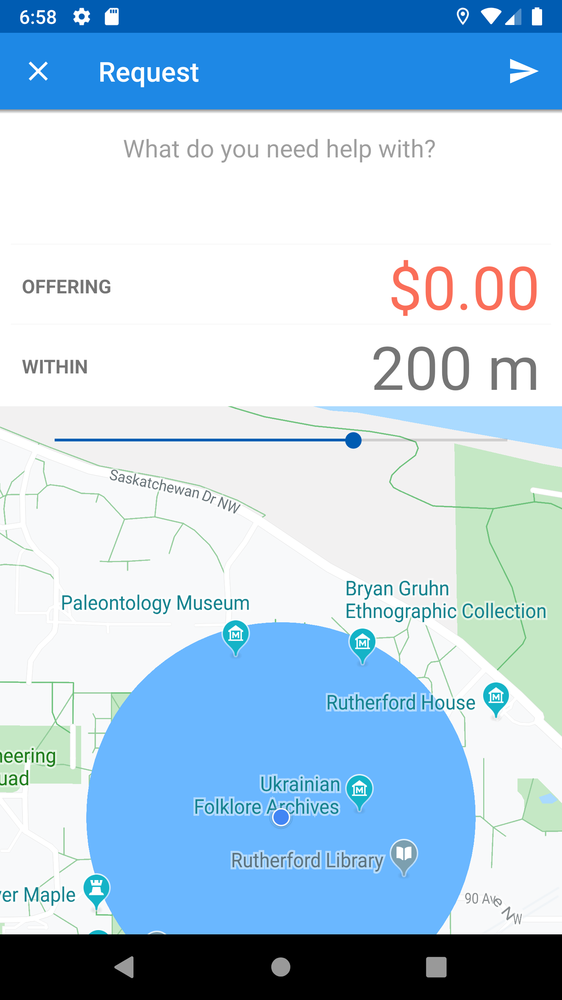
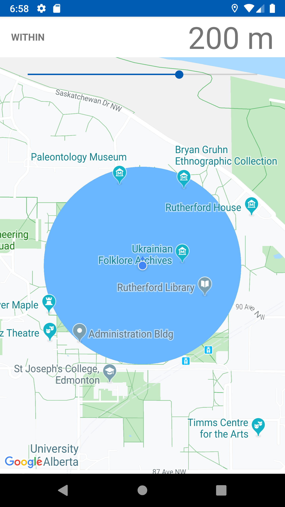
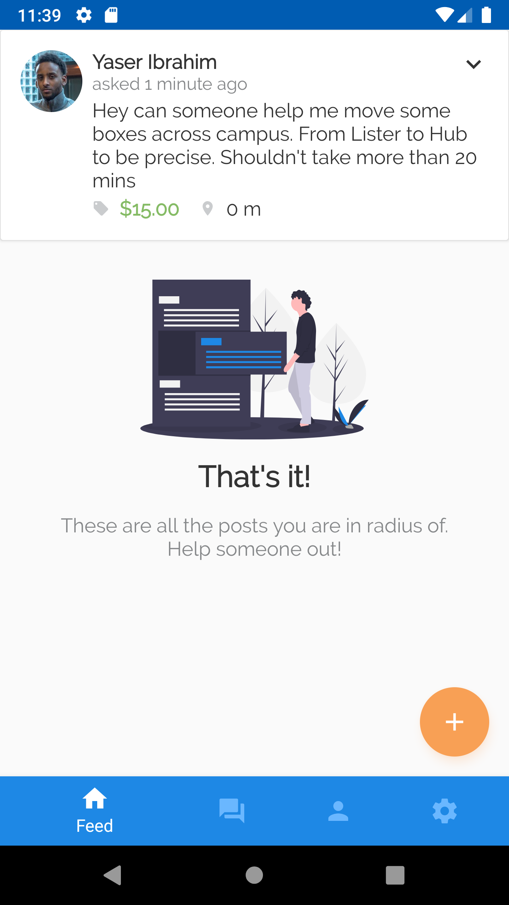
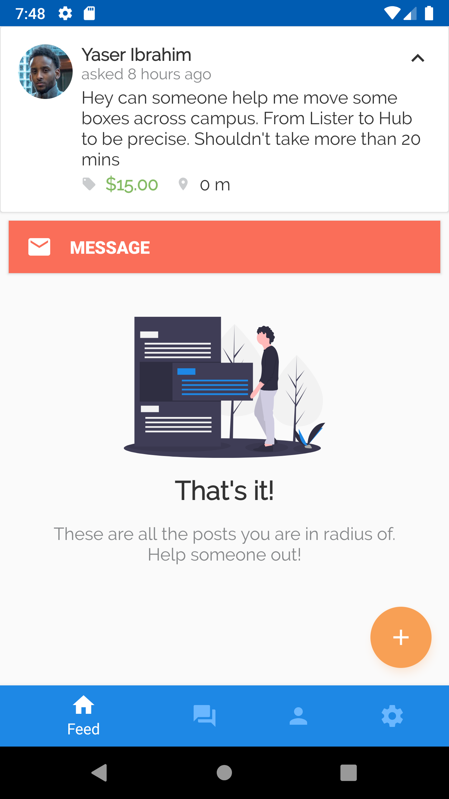
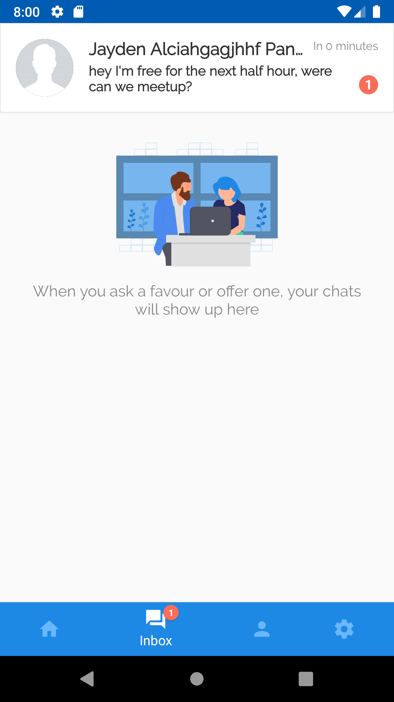

# Objective

The purpose of this app is to create a trust-based, real-time platform where strangers can ask each others for random services. Users may use it for two reasons:

1. Because they're in need of something immediately 
2. Because they can make money off of it without much inconveniece

## Completed

Here are some of the available usecases so far:

1. Make a post requesting a service from those nearby

2. Check the feed for services being requested (based on user's location)

3. Start a chat with users asking for a service 

4. Share their location by sending a map with a pin on current location

   (Google Maps opens with a pin drop at the location upon click)

  

  

  

  

  

  

  

  

## To-Do

Below are some of the tasks and usecases that need to be developed before a launch. Like always, there'll be more to add once I get closer to finishing.

1. Assign service/favor to user
2. Close/Cancel service when done
3. Rate user after service is closed
4. Show ratings on profile view and add sign out option(i.e remove settings page from bottomnav)
5. Create service to track users location outside app
6. refresh JWT's frequently
7. New landing page with mini onboarding tutorial
8. Host backend on cloud.

# How

Here's some of the tech the app relys on:

### Android

The MVP pattern is used to make the code less of a headache to read and write. 

Libraries: 

1. Google Maps API Client 
2. Facebook Graph API Client 
3. Volley Client to handle REST/HTTP communication
4. Socket Client

There's a bit more (UI libs and what not) that'll be shared later on. 

### Backend

1. Node.js
2. Express.js
3. Socket.io.
4. Mongoose/MongoDB. Database currently hosted at Mlabs.  
5. JWT libs used for authentication